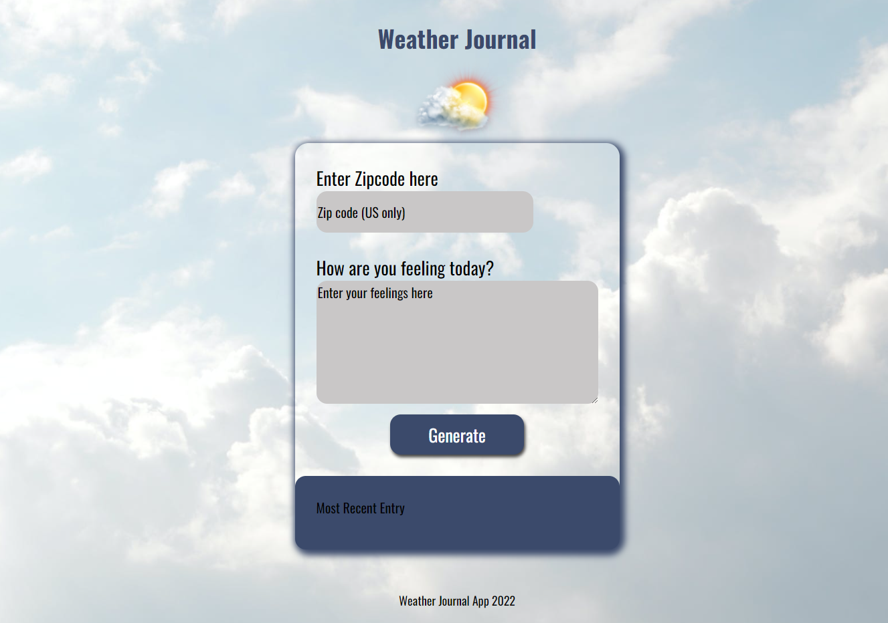

# Weather-Journal App Project
Project 3 - Weather Journal App (Front End Developer Udacity Nanodegree)

## Table of contents
* [Overview](#overview)
* [Preview](#preview)
* [Instructions](#instructions)
* [Development Strategy](#development-strategy)
* [Technologies](#technologies)
* [Resources](#resources)

## Overview
This project is about working with Web APIs and asynchronous code, creating a web app that uses [OpenWeatherMap](https://openweathermap.org/) API to get weather based on user's location, and dynamically update UI. The user can input their zip code (US only) and enter their feelings, which will generate a journal entry. This entry includes the current date, temperature at the location they entered and the text the user wrote.
	
## Preview

## Instructions
* Download the app zip file.
* Unzip it from the desktop.
* Install node.js - [nodejs.org](https://nodejs.org/).
* Install Express; terminal command line - `npm install express.`
* Install Body-Parser; terminal command line - `npm install body-parser.`
* Install Cors; terminal command line - `npm install cors.`  
* Initiate the local server; terminal command line - `node server.js.`

## Development Strategy
* Setting up project environment, making sure Node and packages installed, and included in server.js file.
* Added POST and GET routes to ensure correct retrieval of data from the server.
* Acquired API credentials from OpenWeatherMap website.
* Created async functions to fetch weather data and store it on my local server.
* Set up a function that updated UI dynamically.

## Technologies
* HTML
* CSS
* JavaScript
* Node.js

## Resources
* Background by [Pexels.com](https://www.pexels.com/search/background/).
* Icon by [Hiclipart.com](https://www.hiclipart.com/search?clipart=Icon).
